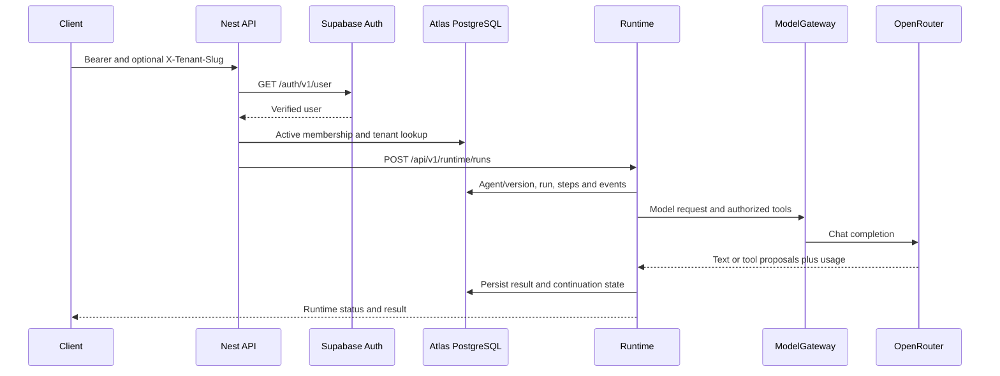
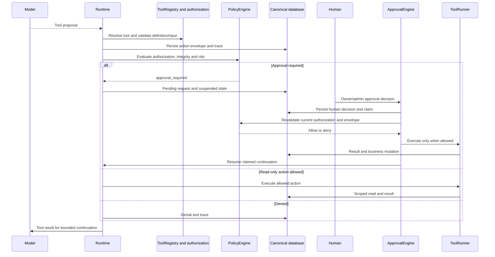
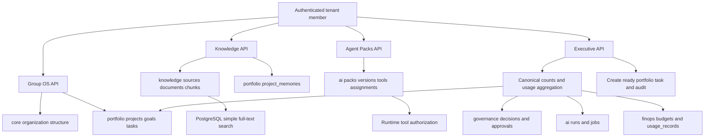
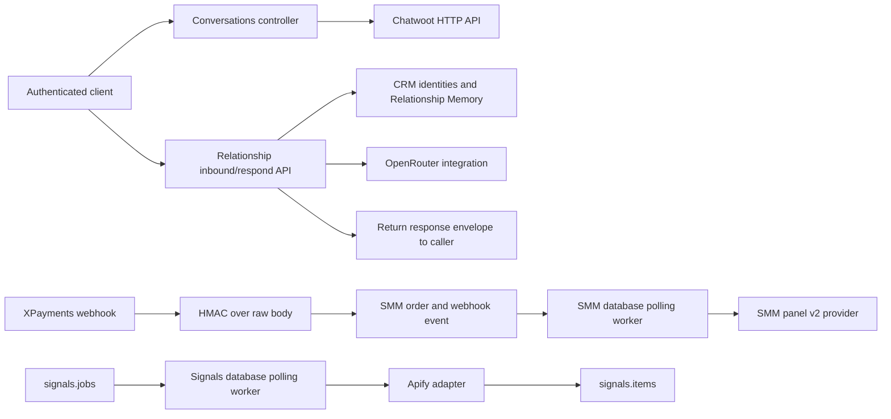

# Atlas communication flows — 2026-10-02

Evidence boundary: repository evidence recorded on 2026-10-02 on `feat/atlas-group-os-v2-integration`; reconciled on 2026-10-03 from starting commit `36d5a04`. Source behavior is **IMPLEMENTED-CODE**; production Compose is **CONFIGURED-CANDIDATE**. Current live activation, DNS, image digests, migration state and provider reachability remain **UNKNOWN/REVERIFY**. No production access or migration execution occurred in this documentation mission. Historical live-environment facts are sourced from the documented 2026-09-30 Atlas HQ read-only baseline. They remain dated evidence and require revalidation before destructive or production-changing actions.

## Authenticated request and synchronous Runtime



Evidence: [guards](../../src/auth/auth.guards.ts), [Auth service](../../src/auth/supabase-auth.service.ts), [Runtime](../../src/runtime/runtime-run.service.ts), [gateway](../../src/runtime/model/model-gateway.service.ts), [provider](../../src/runtime/model/providers/openrouter.provider.ts). Auth lookup uses the configured Supabase endpoint; membership uses core.memberships through Prisma TenantUser. Tenant status must be trial/active. Controllers apply tenant roles where required. Organization-scoped endpoints derive organization from the authenticated tenant. The model proposes actions; it has no direct database credentials or tool execution authority.

## Governed action and human continuation



Evidence: [action service](../../src/runtime/actions/runtime-action.service.ts), [policy](../../src/runtime/policy/policy-engine.service.ts), [approval](../../src/runtime/approval/approval-engine.service.ts), [authorization](../../src/runtime/tools/tool-authorization.service.ts), [runner](../../src/runtime/tools/tool-runner.service.ts). Approved version, active assignment and active pack in the tenant organization authorize pack tools; explicit grants also work. Nonempty constraints fail closed. Disabled definitions, expired/missing approvals, revoked permissions, mismatched envelopes and missing human decisions deny execution. Fixed policy logic executes in trusted code; stored GovernancePolicy JSON is not a general policy DSL. Read-only tools are inspect_run, knowledge.search and executive.brief; portfolio.update_task_status is the governed side effect.

## Asynchronous execution

```mermaid
sequenceDiagram
  participant Client
  participant API as AgentQueueService
  participant DB as ai.execution_jobs
  participant Redis as Redis DB 2 / atlas.agent
  participant Worker as AgentExecutionWorker
  participant Runtime
  Client->>API: POST /api/v1/runtime/jobs
  API->>DB: Store request and actor; status queued
  API->>Redis: Enqueue executionJobId only, attempts 1
  API-->>Client: Durable job ID
  Redis->>Worker: Deliver job ID
  Worker->>DB: Conditional claim and load durable request
  Worker->>Runtime: Start same trusted Runtime
  Runtime-->>Worker: Run ID and runtime status
  Worker->>DB: Persist linked run and execution outcome
  Client->>API: Poll scoped GET runtime/jobs/:id
  API->>DB: Read tenant-scoped durable job
  DB-->>API: Job and linked run state
  API-->>Client: Status
```

Evidence: [queue](../../src/execution-v2/agent-queue.service.ts), [worker](../../src/execution-v2/agent-execution-worker.service.ts), [Redis validation](../../src/execution-v2/redis-connection.ts). Enqueue failure updates the durable job to failed. Queue completion is not proof of Runtime success: inspect linked run and metadata.runtimeStatus, including failed or suspended Runtime outcomes. Prompts remain in durable job requests; Redis payload contains only executionJobId. Reconciliation is required for uncertain claimed work.

## Group OS, Knowledge and Executive



Evidence: [Group OS](../../src/group-os/group-os.service.ts), [Knowledge](../../src/knowledge/knowledge.service.ts), [search](../../src/knowledge/knowledge-query.ts), [Packs](../../src/agent-packs/agent-packs.service.ts), [Executive](../../src/executive/executive.service.ts). Ingest creates canonical source/document/chunks; search checks organization on all three joined tables, active source/document and optional scope filters. Project Operational Memory is separate from Relationship Memory. Executive totals use canonical counts/groupBy independent of capped lists. Delegation creates a task and audit, and does not launch a Runtime job. Pack instructions/model/capability policies and knowledge bindings are stored but not fully consumed by Runtime in this slice. UsageRecord aggregation covers recorded usage; missing records do not prove zero model spend.

## Customer communication and external execution



Evidence: [conversations](../../src/conversations/conversations.controller.ts), [Relationship](../../src/relationship/relationship.service.ts), [integrations](../../src/integrations/), [webhook](../../src/webhooks/webhooks.controller.ts), [polling worker](../../src/execution/atlas-worker.service.ts). Relationship returns a persisted response envelope to its caller; it does not itself deliver that envelope through Chatwoot or Evolution. Relationship inbound/respond are authenticated application endpoints; automatic Chatwoot/Evolution inbound webhook wiring is UNKNOWN/REVERIFY. Do not infer an automatic channel-to-Runtime bridge. XPayments validates the signature before processing, identifies order by payment reference and tracks event deduplication; paid SMM orders are conditionally claimed for fulfillment. Signals jobs are claimed from the database and produce collected items. Live connector registration, endpoint correctness and successful delivery are UNKNOWN/REVERIFY.
