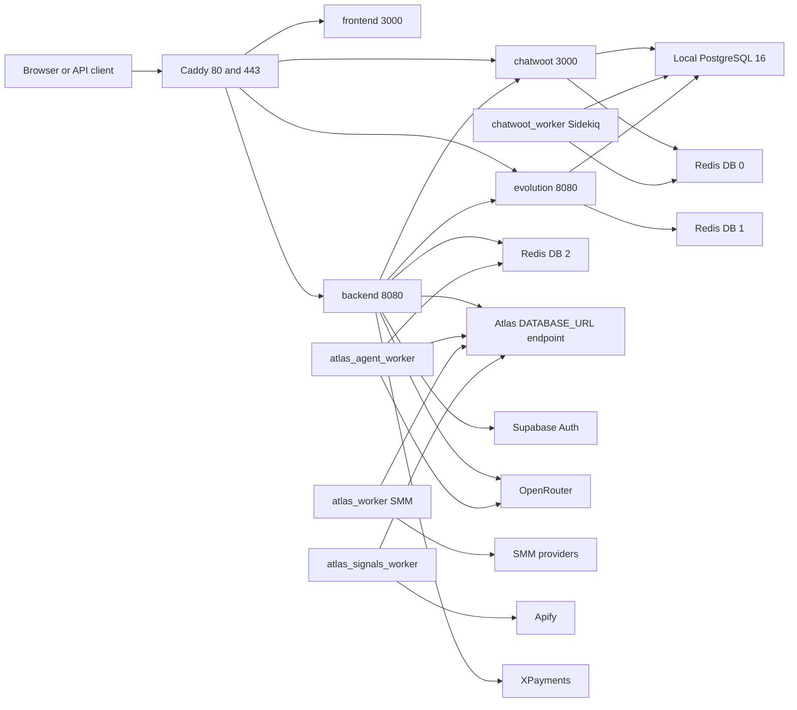
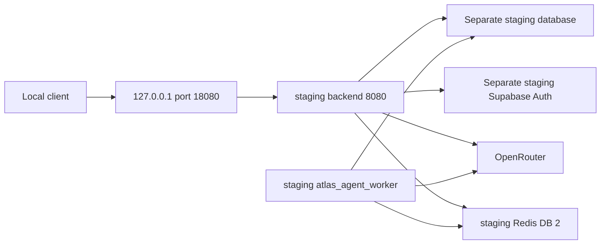

# Atlas current infrastructure — 2026-10-02

Evidence boundary: repository inspected on 2026-10-02 on `feat/atlas-group-os-v2-integration`. Descriptions of source and Compose below are versioned implementation/configuration evidence, not live deployment verification. Live activation, DNS, image digests, database migration state and provider reachability are **UNKNOWN/REVERIFY**. No production access or migration execution occurred in this documentation mission. `LIVE-OBSERVED AS OF 2026-09-30` is reserved for dated external observations with evidence; none were available to substantiate here. The previous mission's complete evidence/status vocabulary and external facts were not present in the supplied history or local documents; no additional status vocabulary is invented.

## Production topology declared in repository

Evidence: [production Compose](../../deploy/production/docker-compose.yml), [Caddyfile](../../deploy/production/Caddyfile), [Auth](../../src/auth/supabase-auth.service.ts), [legacy worker](../../src/execution/atlas-worker.service.ts), [Runtime provider](../../src/runtime/model/providers/openrouter.provider.ts). Redis nodes are logical databases of one configured Redis service, not separate servers. Atlas's DATABASE_URL uses SUPABASE_DATABASE_URL; its actual host and physical relationship to local PostgreSQL are UNKNOWN/REVERIFY. Local initialization creates Chatwoot/Evolution databases; Atlas private schemas are not proven deployed there.

| Service | Declared image or entrypoint | Persistence / purpose |
| --- | --- | --- |
| caddy | caddy:2.10.0-alpine | caddy_data, caddy_config; TLS and reverse proxy |
| postgres | pgvector/pgvector:pg16 | postgres_data; local Chatwoot/Evolution databases |
| redis | redis:7.4-alpine | redis_data; AOF and configured password |
| chatwoot / chatwoot_worker | chatwoot/chatwoot, default v4.16.0-ce | shared chatwoot_storage; Rails / Sidekiq |
| evolution | evoapicloud/evolution-api:v2.3.7 | evolution_instances; PostgreSQL and Redis /1 |
| backend | repository Dockerfile | Nest API; configured port 8080 |
| atlas_agent_worker | same Dockerfile; dist/agent-worker.js | BullMQ agent execution; default concurrency 1 |
| atlas_worker | same Dockerfile; dist/worker.js, mode smm | database polling; SMM fulfillment |
| atlas_signals_worker | same Dockerfile; dist/worker.js, mode signals | database polling; Apify collection |
| frontend | sibling ../../../frontend Dockerfile | external build context; source not inspected here |

All configured production services use `atendimento_internal`, a bridge network. Only Caddy publishes host ports. These image tags and defaults are configuration values; actual deployed versions are UNKNOWN/REVERIFY. Compose gives the two polling workers Redis health dependencies, but their implementation polls PostgreSQL rather than consuming BullMQ.

## Public routing and external boundaries

| Caddy hostname | Configured destination |
| --- | --- |
| atendimento.center, www.atendimento.center | frontend:3000 |
| app.atendimento.center | frontend:3000; root redirects to /app |
| api.atendimento.center | backend:8080 |
| chat.atendimento.center | chatwoot:3000 |
| evo.atendimento.center | evolution:8080, Caddy basic authentication |

These are declared routes; current DNS, certificates, host ownership and availability are UNKNOWN/REVERIFY. Additional AtlasHub domains occur in backend CORS configuration, which does not establish ingress routes. Supabase, OpenRouter, XPayments, SMM endpoints and Apify are external configured integrations; active credentials and live connectivity are UNKNOWN/REVERIFY. No credentials belong in architecture evidence.

## Isolated staging topology

Evidence: [staging Compose](../../deploy/staging/docker-compose.yml), [runbook](../../deploy/staging/README.md). Project `atlas-v2-staging` has a dedicated network and Redis volume, backend loopback publication and concurrency 1. It defines no local PostgreSQL, frontend, Caddy, Chatwoot, Evolution or legacy polling workers. Backend and agent worker share the reviewed immutable staging image. Database/Auth must be separately provisioned. Redis is internal, uses AOF and has no configured staging password. Staging activation is UNKNOWN/REVERIFY; the integration report records static Compose validation only.

## Operational limits

The API initializes its agent queue lazily; synchronous Runtime does not require Redis. Startup still requires database access for normal service initialization, including tool registration. The agent worker requires Redis /2 and database/model configuration. Queue names beyond `atlas.agent` are declared constants, not evidence of active producers/consumers. Attempts are 1; claimed jobs/actions/runs can require manual reconciliation after a crash. Exactly-once side effects are not guaranteed and tool timeouts do not cancel an already running effect.

Migration execution, image builds, staging Auth/provider acceptance, backups and production activation remain UNKNOWN/REVERIFY. See the integration report for recorded dependency advisories and the staging runbook for backup, replay and application rollback. No deployment settings were changed here.
