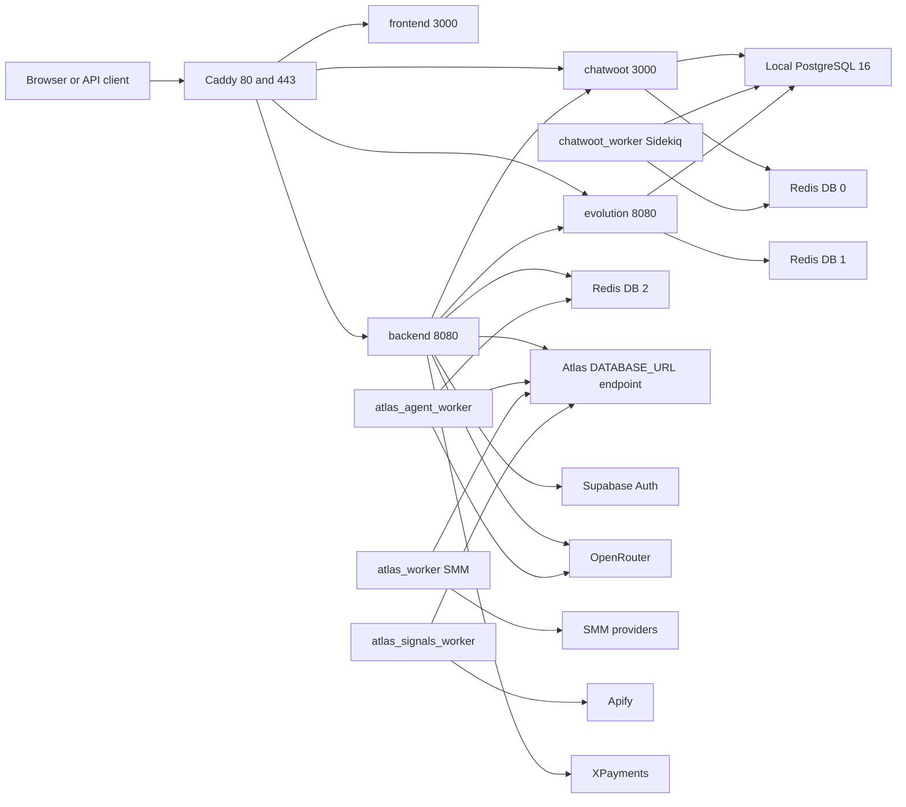
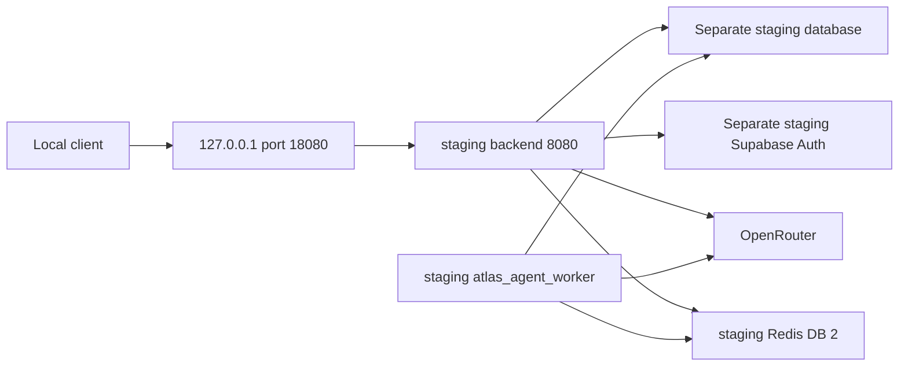

# Atlas current infrastructure — 2026-10-02

Evidence boundary: repository evidence recorded on 2026-10-02 on `feat/atlas-group-os-v2-integration`; reconciled on 2026-10-03 from starting commit `36d5a04`. Source behavior is **IMPLEMENTED-CODE**; production Compose is **CONFIGURED-CANDIDATE**. Current live activation, DNS, image digests, migration state and provider reachability remain **UNKNOWN/REVERIFY**. No production access or migration execution occurred in this documentation mission. Historical live-environment facts are sourced from the documented 2026-09-30 Atlas HQ read-only baseline. They remain dated evidence and require revalidation before destructive or production-changing actions.

## Historical Atlas HQ baseline — 2026-09-30

The following inventory is **LIVE-OBSERVED** as of 2026-09-30 from the documented Atlas HQ read-only baseline, not a fresh host inspection.

| Host attribute | Dated observation |
| --- | --- |
| Hostname / virtualization | atlaswallet; KVM/OpenStack VM |
| OS / kernel | Ubuntu 24.04.4 LTS; 6.8.0-138-generic |
| Root filesystem / RAM / swap | approximately 154 GB / approximately 7.8 GiB / 4 GiB |
| Docker / Docker Compose | 29.7.2 / 5.5.0 |
| Node.js / Python | 22.23.2 / 3.12.3 |
| Network | UFW active; inbound SSH 22022, HTTP 80, HTTPS 443; Caddy published 80/443; platform_edge existed |

Observed Compose projects: `atendimento-center`, `atendimento-flow`, `atlaswallet`, `autohub360`, `autohub360-backend`, `levelab-lia`, `mypets`, `pixbrasil-core`.

Observed core services: Atendimento.Center frontend/backend, Chatwoot and Chatwoot worker, Evolution API, Redis, PostgreSQL/pgvector, Typebot builder/viewer and Typebot PostgreSQL/Redis. Other observed stacks: LeveLab LIA, MyPets, PiXBrasil, AutoHub360 and AtlasWallet.

For n8n, `/srv/platform/n8n` existed, but no active n8n process or systemd service was observed. Historical classification: **PRESENT ON DISK / NOT CONFIRMED RUNNING** (a descriptive observation, not an additional canonical evidence status). Current runtime: **UNKNOWN/REVERIFY**. No other checkout or historical directory was inspected for this correction.

## Edge discrepancy and portfolio intent

**LIVE-OBSERVED** as of 2026-09-30: Caddy was associated with AtlasWallet/shared edge. **CONFIGURED-CANDIDATE** on the current branch: [production Compose](../../deploy/production/docker-compose.yml) declares Caddy inside atendimento-center. Actual edge cutover status is **UNKNOWN/REVERIFY**; the declared topology below does not establish that cutover occurred.

**PLANNED** portfolio intent: KEEP / CORE includes Atendimento.Center, Chatwoot, Evolution, Typebot, PostgreSQL/pgvector, Redis, required shared edge/network and Atlas HQ services. MyPets, LeveLab LIA, PiXBrasil and AutoHub360 are FREEZE/COLD candidates only after recovery validation. The AtlasWallet application may be retired only after Caddy/shared-edge extraction and verification. These are intentions, not completed lifecycle actions.

## Operator identities

| Identity | Evidence and role |
| --- | --- |
| atlas | LIVE-OBSERVED as of 2026-09-30: human/admin with privileged sudo + Docker access; not an autonomous runtime identity |
| atlas-agent | PLANNED identity boundary: restricted Atlas runtime/service identity with no standing sudo/docker authority by design; current provisioning is UNKNOWN/REVERIFY |
| atlas-codex | OPERATOR-CONFIRMED during current implementation: isolated engineering/bootstrap identity; workspace `/srv/atlas/workspaces/atendimento-center-atlas-v2-integration`; not Atlas Group OS itself |

## CONFIGURED-CANDIDATE production topology declared in repository

Evidence: [production Compose](../../deploy/production/docker-compose.yml), [Caddyfile](../../deploy/production/Caddyfile), [Auth](../../src/auth/supabase-auth.service.ts), [legacy worker](../../src/execution/atlas-worker.service.ts), [Runtime provider](../../src/runtime/model/providers/openrouter.provider.ts). Redis nodes are logical databases of one configured Redis service, not separate servers. Atlas's DATABASE_URL uses SUPABASE_DATABASE_URL; its actual host and physical relationship to local PostgreSQL are UNKNOWN/REVERIFY. Local initialization creates Chatwoot/Evolution databases; Atlas private schemas are not proven deployed there.

| Service | Declared image or entrypoint | Persistence / purpose |
| --- | --- | --- |
| caddy | caddy:2.10.0-alpine | caddy_data, caddy_config; TLS and reverse proxy |
| postgres | pgvector/pgvector:pg16 | postgres_data; local Chatwoot/Evolution databases |
| redis | redis:7.4-alpine | redis_data; AOF and configured password |
| chatwoot / chatwoot_worker | chatwoot/chatwoot, default v4.16.0-ce | shared chatwoot_storage; Rails / Sidekiq |
| evolution | evoapicloud/evolution-api:v2.3.7 | evolution_instances; PostgreSQL and Redis /1 |
| backend | repository Dockerfile | Nest API; configured port 8080 |
| atlas_agent_worker | same Dockerfile; dist/agent-worker.js | BullMQ agent execution; default concurrency 1 |
| atlas_worker | same Dockerfile; dist/worker.js, mode smm | database polling; SMM fulfillment |
| atlas_signals_worker | same Dockerfile; dist/worker.js, mode signals | database polling; Apify collection |
| frontend | sibling ../../../frontend Dockerfile | external build context; source not inspected here |

All configured production services use `atendimento_internal`, a bridge network. Only Caddy publishes host ports. These image tags and defaults are configuration values; actual deployed versions are UNKNOWN/REVERIFY. Compose gives the two polling workers Redis health dependencies, but their implementation polls PostgreSQL rather than consuming BullMQ.

## Public routing and external boundaries

| Caddy hostname | Configured destination |
| --- | --- |
| atendimento.center, www.atendimento.center | frontend:3000 |
| app.atendimento.center | frontend:3000; root redirects to /app |
| api.atendimento.center | backend:8080 |
| chat.atendimento.center | chatwoot:3000 |
| evo.atendimento.center | evolution:8080, Caddy basic authentication |

These are declared routes; current DNS, certificates, host ownership and availability are UNKNOWN/REVERIFY. Additional AtlasHub domains occur in backend CORS configuration, which does not establish ingress routes. Supabase, OpenRouter, XPayments, SMM endpoints and Apify are external configured integrations; active credentials and live connectivity are UNKNOWN/REVERIFY. No credentials belong in architecture evidence.

## STAGING-READY isolated staging topology

Evidence: [staging Compose](../../deploy/staging/docker-compose.yml), [runbook](../../deploy/staging/README.md). Project `atlas-v2-staging` has a dedicated network and Redis volume, backend loopback publication and concurrency 1. It defines no local PostgreSQL, frontend, Caddy, Chatwoot, Evolution or legacy polling workers. Backend and agent worker share the reviewed immutable staging image. Database/Auth must be separately provisioned. Redis is internal, uses AOF and has no configured staging password. Staging Compose, ordered migrations, verification SQL and Atlas.Dev acceptance runbook are **STAGING-READY**, not **STAGING-VALIDATED**. Staging activation is UNKNOWN/REVERIFY; the integration report records static Compose validation only.

## Operational limits

The API initializes its agent queue lazily; synchronous Runtime does not require Redis. Startup still requires database access for normal service initialization, including tool registration. The agent worker requires Redis /2 and database/model configuration. Queue names beyond `atlas.agent` are declared constants, not evidence of active producers/consumers. Attempts are 1; claimed jobs/actions/runs can require manual reconciliation after a crash. Exactly-once side effects are not guaranteed and tool timeouts do not cancel an already running effect.

Migration execution, image builds, staging Auth/provider acceptance, backups and production activation remain UNKNOWN/REVERIFY. See the integration report for recorded dependency advisories and the staging runbook for backup, replay and application rollback. No deployment settings were changed here.
