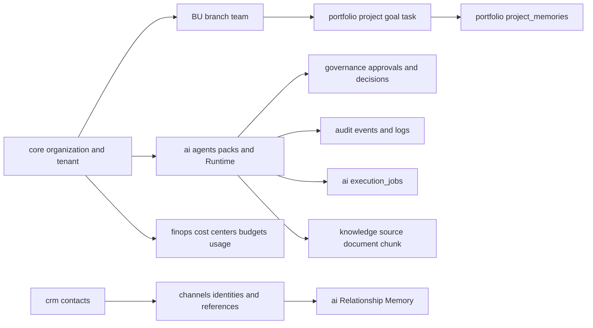
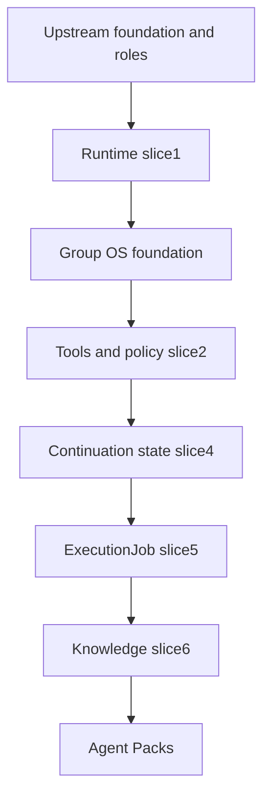

# Atlas service and data map — 2026-10-02

Evidence boundary: repository evidence recorded on 2026-10-02 on `feat/atlas-group-os-v2-integration`; reconciled on 2026-10-03 from starting commit `36d5a04`. Source behavior is **IMPLEMENTED-CODE**; production Compose is **CONFIGURED-CANDIDATE**. Current live activation, DNS, image digests, migration state and provider reachability remain **UNKNOWN/REVERIFY**. No production access or migration execution occurred in this documentation mission. Historical live-environment facts are sourced from the documented 2026-09-30 Atlas HQ read-only baseline. They remain dated evidence and require revalidation before destructive or production-changing actions.

## IMPLEMENTED-CODE ownership and access

| Module/process | Canonical data and responsibility | Evidence |
| --- | --- | --- |
| Auth / tenant guards | core organizations, tenants, memberships; Supabase user verification | src/auth/auth.guards.ts |
| Runtime | ai runtime_runs, runtime_steps, runtime_actions; audit runtime_events; tool definitions/grants | src/runtime/ |
| Execution V2 / agent worker | ai execution_jobs; Redis /2 transports job IDs; Runtime owns run state | src/execution-v2/ |
| Group OS | core business_units, branches, teams, team_memberships; portfolio projects/goals/tasks; governance decisions | src/group-os/ |
| ApprovalEngine | governance approval_requests/approval_decisions, audit logs; linked Runtime actions | src/runtime/approval/ |
| Knowledge | knowledge sources/documents/chunks; portfolio project_memories | src/knowledge/ |
| Agent Packs | ai agent_packs/versions/tools/assignments; knowledge agent_pack_bindings | src/agent-packs/ |
| Executive | organization-scoped canonical aggregation; task delegation and audit | src/executive/ |
| Relationship | CRM contacts, channel identities/references; ai relationship_states, conversation_memories/summaries, open_loops, world_states, agent_runs | src/relationship/ |
| SMM / polling worker | smm providers/services/offers/orders/order_events | src/smm/, src/execution/ |
| Signals / polling worker | signals connectors/sources/jobs/items | src/signals/, src/execution/ |
| Integrations / webhooks | integrations connections/webhook_events; external HTTP adapters | src/integrations/, src/webhooks/ |

Modules share one backend and configured Atlas database. Schema names are logical boundaries, not separate databases. Other schema models in the inventory below do not prove deployed consumers, workers or orchestration.

Arrows express logical application relationships. They do not imply every relationship is a database foreign key. Relationship Memory, organization Knowledge, Project Operational Memory and Runtime continuation state are distinct stores with distinct lifecycles.

## Complete Prisma model/table inventory

Evidence: [schema](../../prisma/schema.prisma). This is a mapping of the checked-in schema, not a live catalog inventory.

| Prisma model | Qualified table |
| --- | --- |
| Organization | `core.organizations` |
| Tenant | `core.tenants` |
| TenantUser | `core.memberships` |
| Entitlement | `core.entitlements` |
| Contact | `crm.contacts` |
| Lead | `crm.leads` |
| CrmActivity | `crm.activities` |
| AppointmentRequest | `crm.appointment_requests` |
| ChannelAccount | `channels.accounts` |
| ConversationRef | `channels.conversation_refs` |
| AiConfiguration | `ai.tenant_configurations` |
| Agent | `ai.agents` |
| AgentVersion | `ai.agent_versions` |
| AgentBinding | `ai.agent_bindings` |
| ContactIdentity | `channels.contact_identities` |
| RelationshipState | `ai.relationship_states` |
| ConversationMemory | `ai.conversation_memories` |
| ConversationSummary | `ai.conversation_summaries` |
| OpenLoop | `ai.open_loops` |
| AgentWorldState | `ai.world_states` |
| AgentRun | `ai.agent_runs` |
| AgentFollowup | `ai.followups` |
| FlowDefinition | `flows.definitions` |
| FlowRun | `flows.runs` |
| AutomationWorkflow | `automation.workflows` |
| AutomationRun | `automation.runs` |
| SmmProvider | `smm.providers` |
| SmmService | `smm.services` |
| SmmOffer | `smm.offers` |
| SmmOrder | `smm.orders` |
| SmmOrderEvent | `smm.order_events` |
| SignalConnector | `signals.connectors` |
| SignalSource | `signals.sources` |
| SignalJob | `signals.jobs` |
| SignalItem | `signals.items` |
| IntegrationConnection | `integrations.connections` |
| WebhookEvent | `integrations.webhook_events` |
| AuditLog | `audit.logs` |
| RuntimeRun | `ai.runtime_runs` |
| RuntimeStep | `ai.runtime_steps` |
| RuntimeEvent | `audit.runtime_events` |
| ToolDefinitionRecord | `ai.tool_definitions` |
| ToolGrant | `ai.tool_grants` |
| RuntimeAction | `ai.runtime_actions` |
| ExecutionJob | `ai.execution_jobs` |
| BusinessUnit | `core.business_units` |
| Branch | `core.branches` |
| Team | `core.teams` |
| TeamMembership | `core.team_memberships` |
| PortfolioProject | `portfolio.projects` |
| PortfolioGoal | `portfolio.goals` |
| PortfolioTask | `portfolio.tasks` |
| GovernanceDecision | `governance.decisions` |
| GovernancePolicy | `governance.policies` |
| ApprovalRequest | `governance.approval_requests` |
| ApprovalDecision | `governance.approval_decisions` |
| CostCenter | `finops.cost_centers` |
| Budget | `finops.budgets` |
| UsageRecord | `finops.usage_records` |
| KnowledgeSource | `knowledge.sources` |
| KnowledgeDocument | `knowledge.documents` |
| KnowledgeChunk | `knowledge.chunks` |
| ProjectMemory | `portfolio.project_memories` |
| AgentPack | `ai.agent_packs` |
| AgentPackVersion | `ai.agent_pack_versions` |
| AgentPackTool | `ai.agent_pack_tools` |
| AgentPackAssignment | `ai.agent_pack_assignments` |
| AgentPackKnowledgeBinding | `knowledge.agent_pack_bindings` |

## STAGING-READY SQL artifacts and migration boundary

[SQL migrations](../../database/migrations/) are authoritative for checks, RLS, triggers, generated columns, partial indexes and SQL foreign keys not fully represented in Prisma. Do not use Prisma db push or generated migration diffs to activate this integration. [Verification queries](../../database/verification/) describe expected catalog evidence, not successful execution evidence.

Apply only through the reviewed [manifest](../../database/atlas-v2-migration-order.json): Runtime slice1 → Group OS foundation → tools/policy slice2 → model continuation slice4 → ExecutionJob slice5 → Knowledge slice6 → Agent Packs. Prerequisites include upstream schemas/foundation, gen_random_uuid(), core.set_updated_at() and Supabase anon/authenticated roles. No migration application is established by this documentation.

Approval request run/action IDs, Runtime approval IDs and FinOps usage run IDs include application-managed soft links. Cross-record organization consistency relies on trusted services rather than comprehensive composite SQL FKs. RLS DDL exists, but actual application-role privileges and bypass behavior are UNKNOWN/REVERIFY. Knowledge chunks use a stored `simple` tsvector and GIN index; this slice implements PostgreSQL full-text search, not a demonstrated vector retrieval pipeline.

Optional Atlas Internal seed requires core.organizations slug atlas-internal; it bootstraps operating structure including TECH, atlas-dev and ATLAS-GROUP-OS. Seed presence does not prove those records exist live, and the seed creates no agent or pack. Replay may update statuses. IF NOT EXISTS guards do not repair divergent definitions. Follow the staging runbook for backup, transactional execution, catalog verification, replay rehearsal and recovery.

## Reverification gaps

Live database host, applied migrations, deployed schemas/RLS privileges, actual organization/tenant records, active agents/packs/grants, connector credentials, job backlog, Redis key isolation, real model cost attribution and staging acceptance are UNKNOWN/REVERIFY. The historical host and service inventory is **LIVE-OBSERVED** as of 2026-09-30; it does not validate current Atlas V2 schemas, migrations or activation.
